# UK Road Collision Severity: Core Figures and Visual Story

**English** | [简体中文](figure_story_zh-CN.md)

> Data source: UK Department for Transport (DfT) road collision data, 2021–2025.
> Population analysed: reported personal-injury road collisions. KSI means Killed or Seriously Injured.
> Note: KSI shares in these figures are proportions among reported collisions, not road-risk measures standardised by traffic volume, population or vehicle mileage.

## Story overview

This project examines which temporal, road, environmental and spatial conditions are associated with more severe collision outcomes, and whether machine learning can use information known at collision time to identify higher KSI risk. The story progresses from description to prediction: reported collision volume broadly stabilises while the smoothed KSI share rises; road and environmental variables are interrelated rather than acting in isolation; additional historical data narrows the model's generalisation gap; and the final model identifies most KSI collisions at the selected threshold but still produces many false positives and overestimates absolute risk.

---

## Part I - From reported collisions to severity patterns

## 1. KSI is a minority but consequential collision outcome

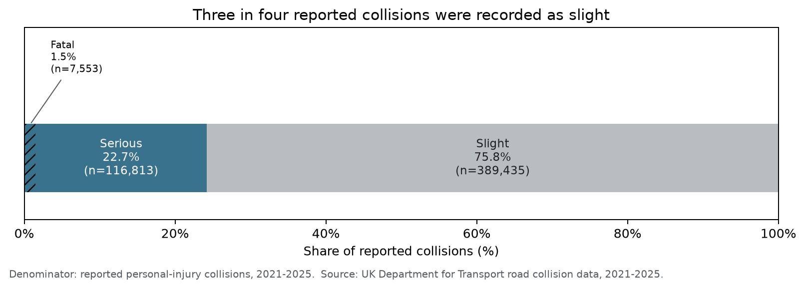

### What the figure shows

A percentage stacked bar presents the composition of fatal, serious and slight collisions, with direct labels for shares and sample sizes.

### What it represents

Across five years, 513,801 collisions were recorded: 389,435 slight collisions (75.8%), 116,813 serious collisions (22.7%) and 7,553 fatal collisions (1.5%). Fatal and serious collisions total 124,366, giving a KSI share of 24.2%.

### Interpretation boundary

The figure describes the distribution of outcomes among reported collisions. It does not represent the probability that an ordinary journey results in a collision or a KSI outcome.

---

## 2. Collision volume is stable, but recording practice changes substantially

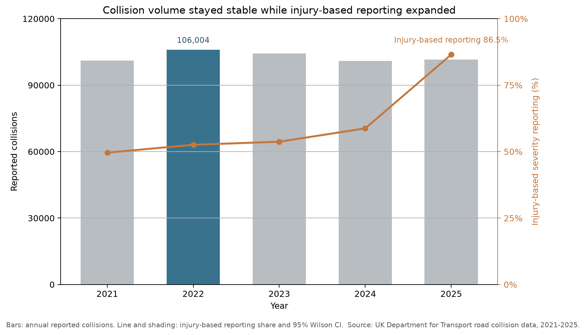

### What the figure shows

Bars show annual collision volume on a shared time axis, while the orange line shows the share recorded using injury-based severity reporting. The year with the highest collision volume is highlighted in muted blue and labelled directly; the remaining bars are grey.

### What it represents

Annual collision volume ranges from 100,927 to 106,004, peaking at 106,004 in 2022 and varying relatively little across the five years. Injury-based reporting rises from 49.6% in 2021 to 86.5% in 2025, an increase of 36.9 percentage points. The increase from 2024 to 2025 alone is approximately 27.8 percentage points.

### Interpretation boundary

The line describes recording practice rather than road risk. It cannot establish that roads became safer or more dangerous over the period.

---

## 3. Monthly collision volume stabilises while the KSI share rises

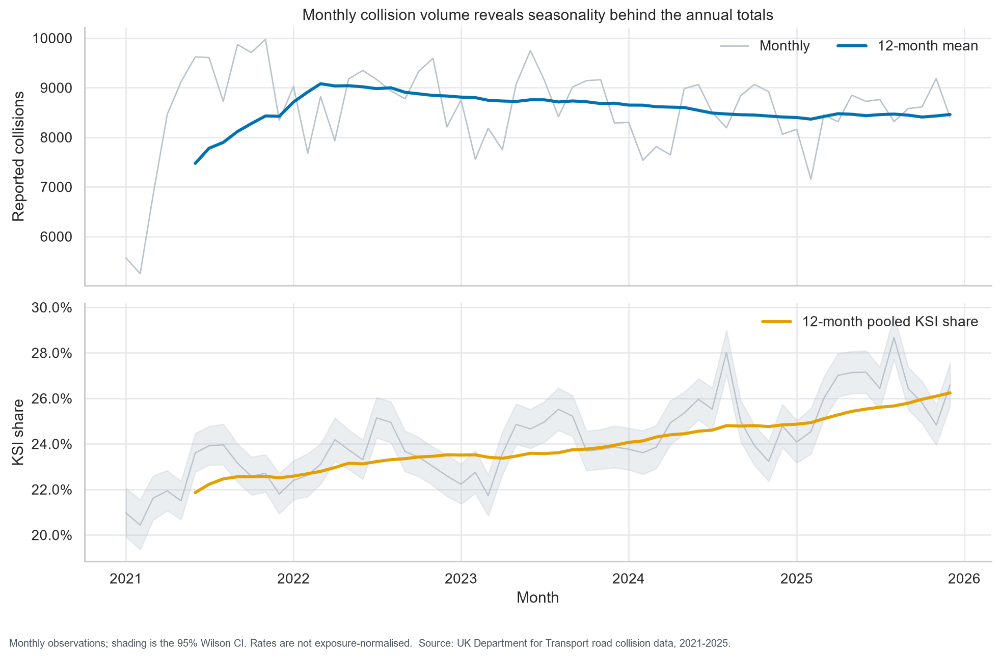

### What the figure shows

The upper panel shows monthly reported collision volume, while the lower panel shows monthly KSI share with a 95% Wilson confidence interval. Both panels include 12-month smoothers.

### What it represents

After the low levels at the start of 2021, monthly collision volume broadly stabilises. In contrast, the pooled 12-month KSI share rises from approximately 21.9% in mid-2021 to 26.2% at the end of 2025, an increase of about 4.4 percentage points. Collision frequency and severity therefore do not follow the same temporal pattern.

### Interpretation boundary

The figure is not standardised by traffic volume or vehicle mileage, and cross-year comparisons are affected by changes in severity-recording practice. It cannot be interpreted directly as an increase in road risk.

---

## 4. The peaks in collision volume and severity do not coincide

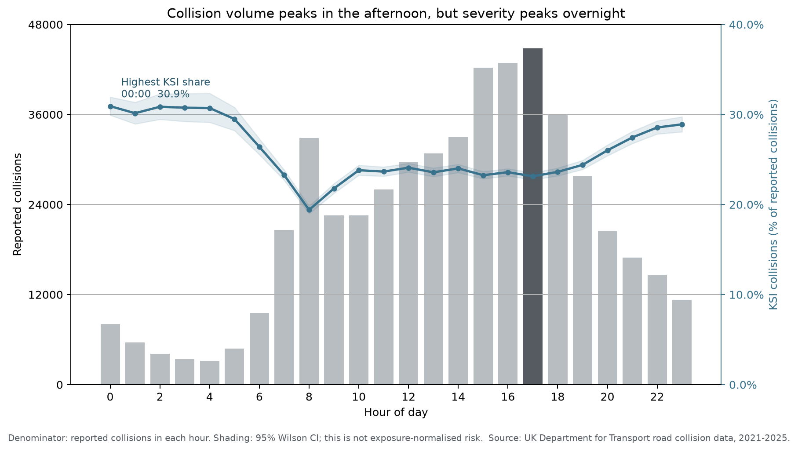

### What the figure shows

Bars show the number of reported collisions by hour, while the blue line shows KSI share with a 95% Wilson confidence interval on the same time axis.

### What it represents

Collision volume peaks at 17:00 with 44,792 collisions, when the KSI share is approximately 23.1%. KSI share is highest at 00:00, at 30.9%, and lowest at 08:00, at 19.4%. The difference is 11.5 percentage points, and the midnight KSI share is approximately 1.59 times the 08:00 share.

### Interpretation boundary

The data is not standardised by hourly traffic flow or vehicle mileage. The figure therefore does not measure individual travel risk or establish specific causes.

---

## 5. Unlit darkness corresponds to a higher KSI share

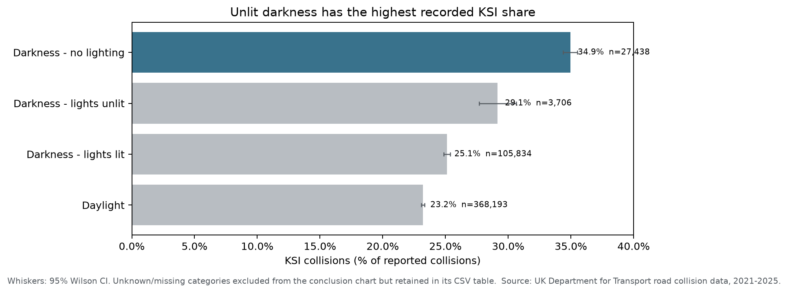

### What the figure shows

The chart compares KSI share, collision count and 95% Wilson confidence intervals across lighting conditions, highlighting the category with the highest share.

### What it represents

KSI accounts for 34.9% of collisions in darkness with no road lighting (n=27,438), compared with 23.2% in daylight (n=368,193), a difference of 11.8 percentage points. The former is approximately 1.51 times the latter. Darkness with street lights lit has a KSI share of 25.1%, between the two.

### Interpretation boundary

This is an unadjusted association. Unlit roads are also more likely to be rural or in higher-speed environments, so the entire difference cannot be attributed to lighting.

---

## 6. Road-context variables are related, but no single factor dominates KSI

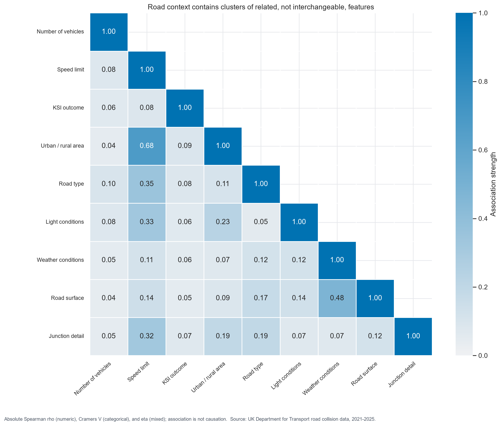

### What the figure shows

The simplified matrix retains nine core variables and uses absolute Spearman correlation, Cramer's V or correlation ratio eta according to variable type.

### What it represents

The strongest feature-to-feature association is between speed limit and urban-rural context (0.68), followed by weather and road surface (0.48), and speed limit and road type (0.35). Every univariate association with KSI is below 0.10, suggesting that severe outcomes reflect combinations of road, environmental and vehicle conditions rather than one isolated factor.

### Interpretation boundary

The cells do not all use the same association statistic. Values communicate strength rather than direction and do not establish causal effects.

---

## 7. The pattern associated with speed limits depends on urban-rural context

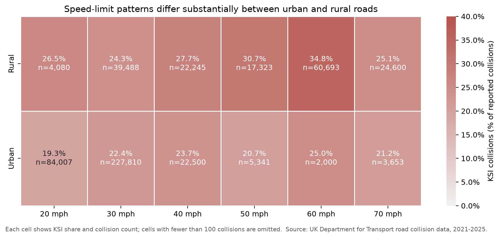

### What the figure shows

A red sequential heatmap compares KSI shares across combinations of urban–rural context and speed limit. Every cell directly labels the share and collision count.

### What it represents

Rural 60 mph roads have the highest KSI share, at 34.8% (n=60,693), compared with 25.0% on urban 60 mph roads (n=2,000), a difference of 9.8 percentage points. The urban–rural gap at 50 mph is similarly pronounced, with the rural share 9.9 percentage points higher. Rural KSI shares exceed urban shares in all six displayed speed groups, although the gaps range from 1.9 to 9.9 percentage points. The 70 mph group does not have the highest KSI share.

### Interpretation boundary

The cells show KSI share after a collision has occurred, not collision risk per road kilometre. They also do not establish that higher speed limits cause the full observed difference.

---

## 8. Collision-density hotspots differ from severity hotspots

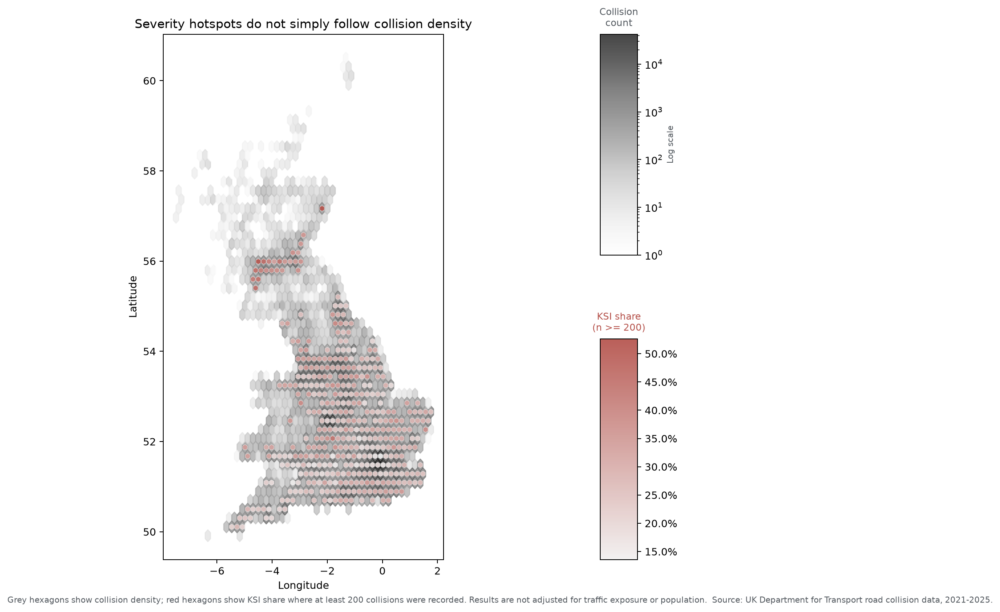

### What the figure shows

Collision coordinates are aggregated in one hexagonal spatial view. Grey intensity represents collision-count density, while red hexagons represent KSI share in cells meeting a minimum threshold of 200 collisions.

### What it represents

A total of 403 cells meet the 200-collision threshold, with KSI shares ranging from approximately 13.6% to 52.6%. Across these cells, the Spearman correlation between collision count and KSI share is approximately -0.41, indicating that denser collision cells do not tend to have higher severity shares at the same time.

### Interpretation boundary

This is not a traffic-exposure risk map and does not control for population, road length or traffic volume. Blank areas or areas without red overlays do not indicate an absence of risk.

---

## Part II - From model design to held-out evaluation

## 9. LightGBM narrowly leads CatBoost, while tree ensembles dominate

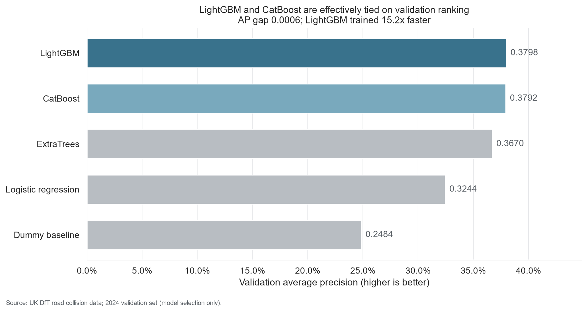

### What the figure shows

Dummy, logistic regression, ExtraTrees, CatBoost and LightGBM are compared on the same historical training set and 2024 validation set using Average Precision and Brier score. Ranking uses validation Average Precision only.

### What it represents

LightGBM achieves validation Average Precision of 0.3798, narrowly ahead of CatBoost at 0.3792; the difference is only 0.0006. ExtraTrees reaches 0.3670 and logistic regression 0.3244, both above the 0.2484 no-skill baseline. CatBoost and ExtraTrees have Brier scores of 0.2296 and 0.2242, below LightGBM's 0.2311. The Dummy model's lower Brier score reflects prevalence prediction rather than useful ranking. LightGBM is therefore retained under the primary ranking metric.

### Interpretation boundary

Brier score combines discrimination and calibration and should not select a ranking model by itself. LightGBM and CatBoost are effectively very close here, so this result does not establish that LightGBM will win in every future year.

---

## 10. More historical data narrows the generalisation gap, but gains slow

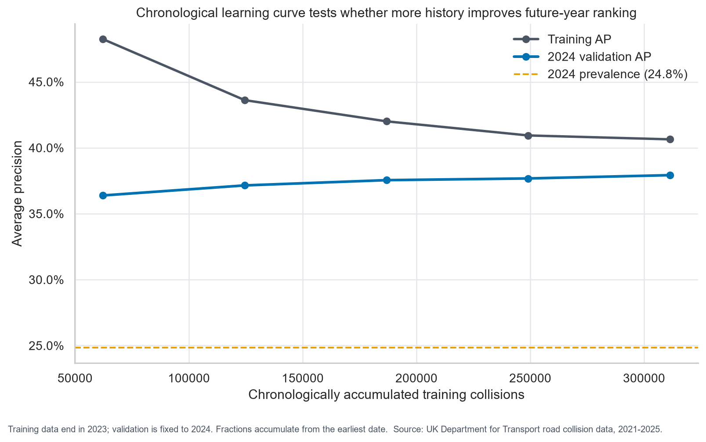

### What the figure shows

The curve expands the 2021-2023 training data chronologically while keeping 2024 as a fixed future validation year.

### What it represents

Training Average Precision falls from 0.482 to 0.406 as the sample becomes more representative, while validation Average Precision rises from 0.364 to 0.379. The gap narrows throughout, and every validation result remains above the 0.248 KSI prevalence baseline. Additional history improves future-year ranking, although the final increments are small and indicate an approaching plateau.

### Interpretation boundary

The curve describes one fixed model configuration and one future validation year. It supports a generalisation diagnosis but does not guarantee that every additional dataset would produce the same gain.

---

## 11. Vehicle count, speed and road context provide the most predictive information

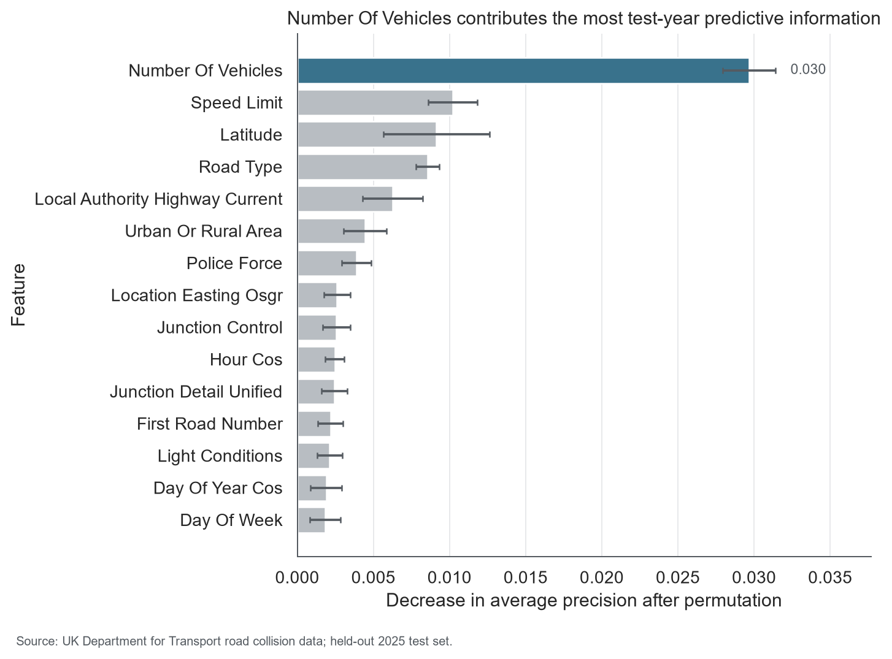

### What the figure shows

Permutation importance measures the decrease in model Average Precision after each feature is randomly shuffled. Error bars show uncertainty across repeated estimates, and the largest importance value is labelled directly.

### What it represents

Number of vehicles contributes the largest importance: shuffling it reduces Average Precision by 0.0292 on average (standard deviation 0.0019), approximately 2.9 times the second-ranked speed limit value of 0.0102. Road type has an importance of 0.0086, while latitude reaches 0.0082 with a wider error bar.

### Interpretation boundary

Permutation importance measures contribution to predictions from the current model, not causal influence. Correlated features may also divide importance between them.

---

## 12. The model exceeds the baseline, but discrimination remains limited

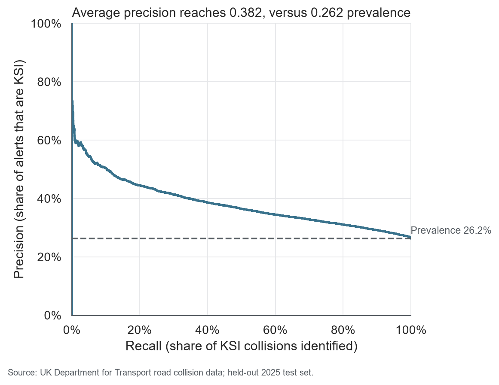

### What the figure shows

The precision–recall curve shows the trade-off between KSI precision and recall across thresholds in the held-out test year. KSI prevalence provides the no-skill baseline.

### What it represents

The model achieves an Average Precision of 0.382, which is 0.120 above the KSI prevalence baseline of 0.262 and approximately 1.46 times that baseline. The model ranks more KSI collisions toward the front of the prediction order, but the curve approaches the baseline quickly when high recall is required, indicating limited overall discrimination.

### Interpretation boundary

Average Precision is not prediction accuracy. The result describes generalisation under the current temporal split and feature set.

---

## 13. The selected threshold favours recall but produces many false positives

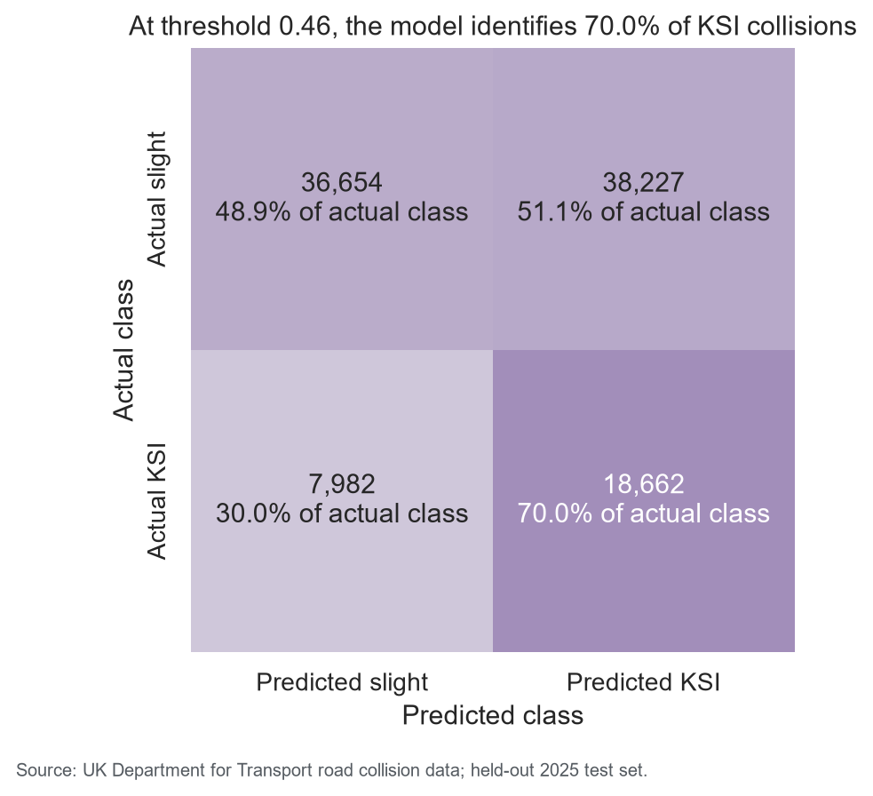

### What the figure shows

A purple sequential heatmap presents counts and within-row shares for actual and predicted classes in the test year, using the threshold of 0.46 selected on the validation year.

### What it represents

The model correctly identifies 18,662 KSI collisions and misses 7,982, giving a KSI recall of 70.0% and a false-negative rate of 30.0%. It produces 56,889 KSI alerts, of which 38,227 are false positives, giving a precision of 32.8%. At the same threshold, 51.1% of actual slight collisions are classified as KSI.

### Interpretation boundary

The confusion matrix depends on the chosen threshold. Changing the threshold changes recall, precision and the number of false positives simultaneously.

---

## 14. Predicted risk probabilities remain miscalibrated

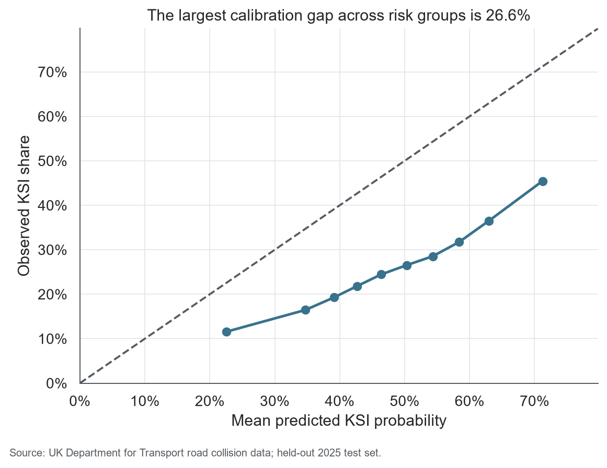

### What the figure shows

The test records are divided into ten equal-sized groups by predicted risk. The chart compares each group's mean predicted KSI probability with its observed KSI share; the diagonal represents perfect calibration.

### What it represents

All ten risk groups fall below the ideal calibration line, showing that the model systematically overestimates KSI probabilities in the 2025 test data. The largest absolute gap is 26.6 percentage points. In the highest predicted-risk group, the mean predicted probability is 71.3%, while the observed KSI share is 45.6%. The model retains ranking information, but its probability values should not be interpreted literally.

### Interpretation boundary

The calibration curve depends on the grouping method and sample distribution. The ten-group result is a diagnostic summary.

---

## 15. Model inputs and predicted risk stay stable as the model is deployed to 2025

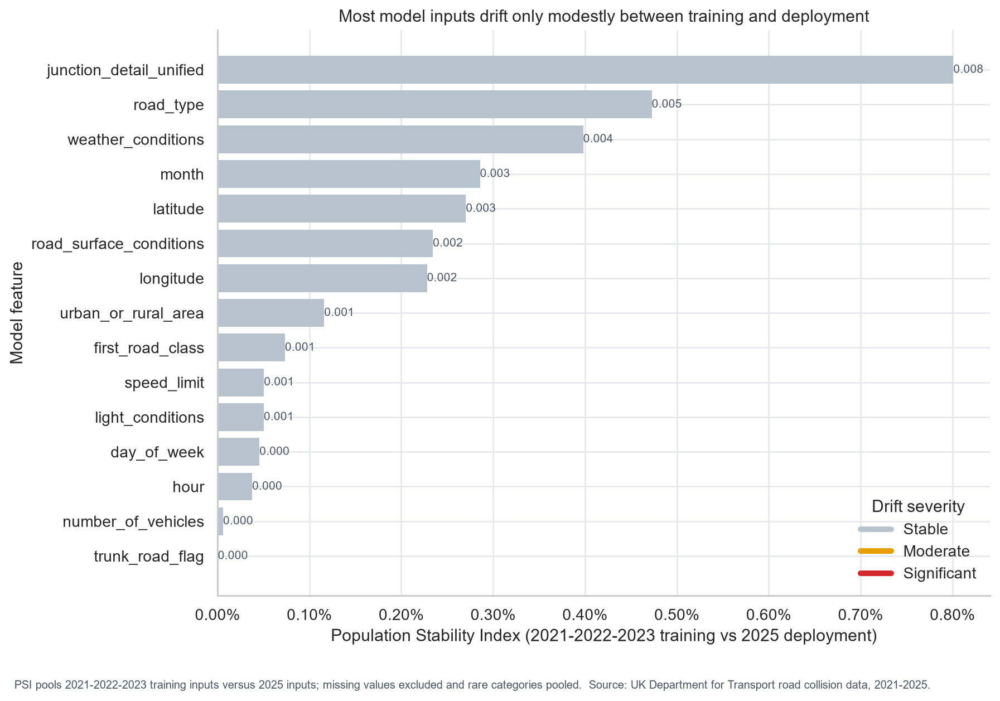

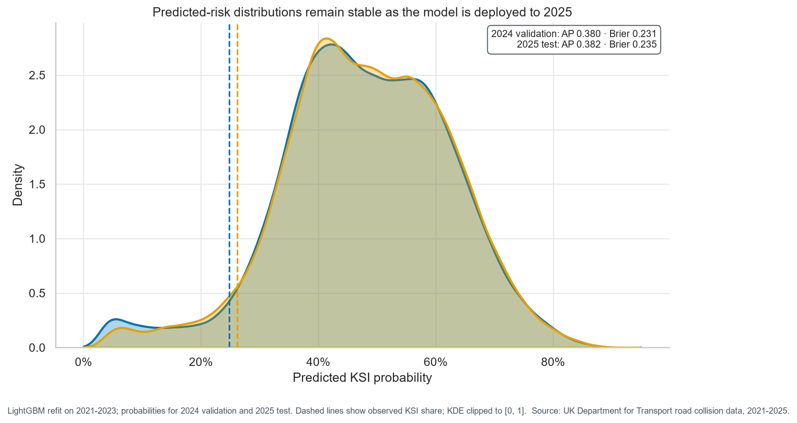

### What the figure shows

The first chart ranks fifteen model inputs by the Population Stability Index (PSI) between the pooled 2021-2023 training inputs and the 2025 deployment inputs, colouring each bar by drift severity (PSI below 0.1 is stable, 0.1-0.25 moderate, 0.25 and above significant). The second chart overlays the predicted KSI probability distributions for the 2024 validation and 2025 test years, with each year's observed KSI share marked by a dashed line and its Average Precision and Brier score annotated.

### What it represents

All fifteen inspected inputs stay below the stable-drift threshold (PSI below 0.1): the largest shift is junction_detail_unified at 0.008, followed by road_type (0.005) and weather_conditions (0.004), with no input reaching even moderate drift. Predicted-risk distributions nearly overlap across deployment years (mean predicted probability 0.479 in 2024 vs 0.483 in 2025) even as observed KSI prevalence rises from 24.8% in 2024 to 26.2% in 2025. Average Precision is 0.3798 on 2024 and 0.3819 on 2025, and Brier score moves from 0.2311 to 0.2349, so the model's ranking and probability error stay stable even as the observed KSI share changes and the model faces an out-of-distribution year value in 2025.

### Interpretation boundary

PSI describes how much the distribution of recorded inputs changed between periods, not why it changed or what caused it; missing values are excluded and rare categories are pooled. Stable inputs do not prove the model will remain stable for any future year. The model was itself trained with collision_year as an available input, so the year is not among the inspected drift features. The second chart describes one fixed LightGBM configuration refit on 2021-2023; a different model or training window could behave differently.

---

## Supplementary model diagnostics: ranking curves and training cost

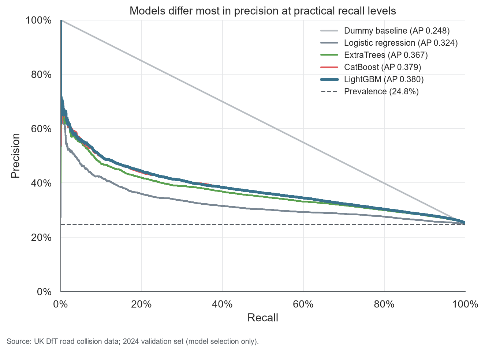

The five validation curves confirm that LightGBM and CatBoost remain very close across most recall levels. ExtraTrees ranks next, while logistic regression and the Dummy baseline are substantially weaker. This chart compares risk ranking and is not used to choose the final classification threshold.

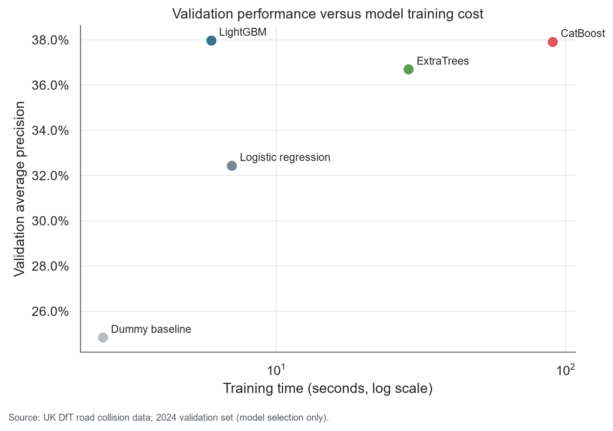

LightGBM reaches the highest validation AP in approximately 5.9 seconds, compared with about 90.0 seconds for a near-identical CatBoost result. ExtraTrees takes approximately 28.6 seconds and achieves lower AP. Training time depends on hardware and runtime conditions, so these values support relative comparison within this experiment only.

---

## Part III - Overall conclusions

1. KSI is a minority but consequential target that requires class-sensitive evaluation metrics.
2. Severity-recording practice changes substantially across the period, affecting cross-year interpretation.
3. Monthly collision volume broadly stabilises while the smoothed KSI share rises, so frequency and severity trends do not coincide.
4. Speed, urban-rural context, road type and lighting are interrelated; no single factor dominates the KSI outcome.
5. Darkness, speed, urban-rural context, road structure and spatial context are associated with collision severity.
6. Additional historical data narrows the gap between training and future-year validation, but performance gains slow.
7. Tree ensembles outperform the linear baseline; LightGBM and CatBoost are very close, with LightGBM narrowly ahead on this validation year.
8. At the selected threshold, the model is recall-oriented rather than a high-precision collision classifier.
